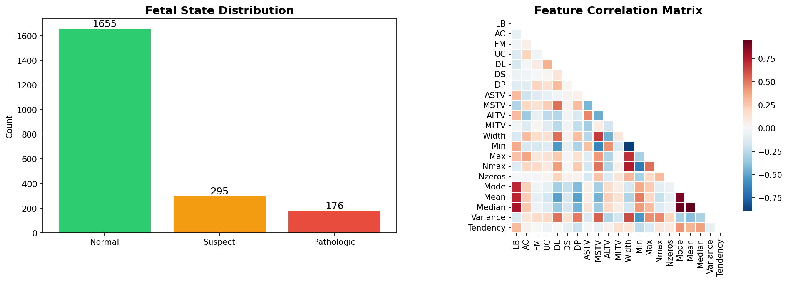
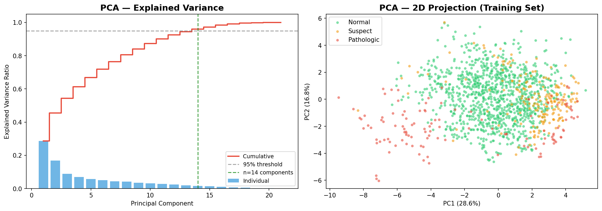
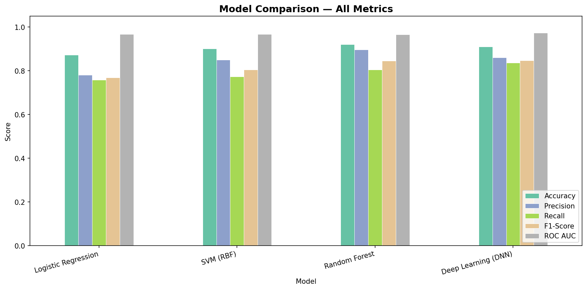
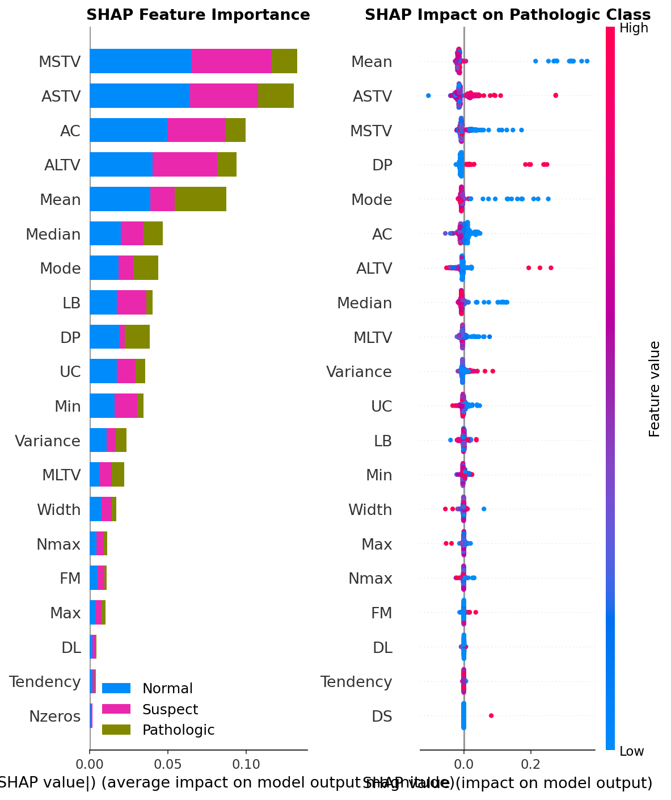

# CTG Classification Project

Machine learning project for **fetal state classification** from cardiotocography (CTG) signals.

The dataset comes from the [UCI Cardiotocography repository (ID: 193)](https://archive.ics.uci.edu/dataset/193/cardiotocography). Each record includes 21 features extracted from the signal (fetal heart rate, variability, decelerations, uterine contractions, histogram statistics, etc.) and an **NSP** label with three classes: **Normal**, **Suspect**, and **Pathologic**.

## Pipeline

The notebook (and the equivalent script) runs a full analysis workflow:

1. Exploratory data analysis
2. PCA — explained variance and dimensionality reduction
3. Shallow classifiers — Logistic Regression, SVM (RBF), and Random Forest on PCA features
4. Evaluation — accuracy, precision, recall, F1, ROC AUC, confusion matrices, and ROC curves
5. Deep learning — feed-forward neural network with early stopping
6. Explainability — SHAP analysis for Random Forest predictions

Generated plots are saved to `outputs/`.

## Sample outputs

### Exploratory analysis


### PCA


### Model comparison


### Explainability


## Project Files

- `CTG_Classification_Project.ipynb` — main notebook (full pipeline)
- `CTG_Classification_Project.py` — script version of the same workflow
- `CTG.csv` — dataset used by the project
- `Report_CTG_ITALIAN.docx` — project report (Italian, source)
- `Report_CTG_ITALIAN.pdf` — project report (Italian, PDF)
- `Report_CTG_ENGLISH.docx` — project report (English, source)
- `Report_CTG_ENGLISH.pdf` — project report (English, PDF)
- `build_english_report.py` — script to regenerate the English docx from the Italian one
- `requirements.txt` — Python dependencies

## Requirements

- Python 3.10+ (3.11 recommended)
- `pip`

## Quick Start

1. Open a terminal in this folder.
2. Create and activate a virtual environment:

```bash
python3 -m venv .venv
source .venv/bin/activate
```

3. Install dependencies:

```bash
pip install --upgrade pip
pip install -r requirements.txt
```

4. Launch Jupyter Notebook:

```bash
jupyter notebook
```

5. Open `CTG_Classification_Project.ipynb` and run all cells from top to bottom.

Alternatively, run the script directly:

```bash
python CTG_Classification_Project.py
```

## What You Should See

- Data exploration plots (`outputs/01_eda.png`, `outputs/02_pca.png`, …)
- Confusion matrices and ROC curves (`outputs/03_confusion_matrices.png`, …)
- Deep learning training curves and model comparison
- Feature importance and SHAP plots (`outputs/08_rf_feature_importance.png`, …)

## Reproducibility Notes

- The notebook uses fixed random seeds where relevant.
- Train/validation/test split is 70/20/10, stratified by class.
- Keep the same execution order (top to bottom) to avoid missing variables/state.

## Troubleshooting

- If TensorFlow install fails on your machine, first run:

```bash
pip install --upgrade pip setuptools wheel
```

- If SHAP plots fail to render, ensure `matplotlib` is installed and rerun the SHAP cells.
- If kernel errors appear in Jupyter, restart kernel and run all cells again.
